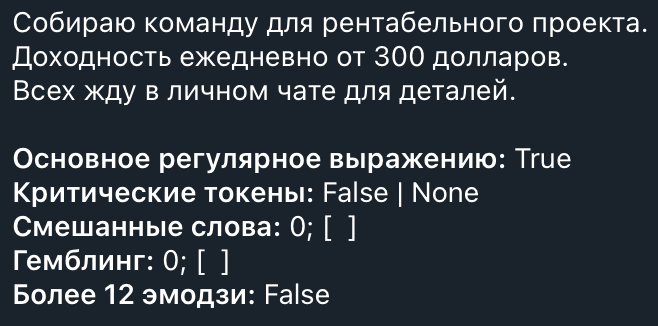

# Telegram-бот для удаления спама

## Введение

Этот бот предназначен для автоматического определения и удаления спама на основе регулярных выражений, а также удаления статусных сообщений. Он позволяет администраторам регистрировать чаты, в которых будет удаляться спам, а логи удаленного спама будут пересылаться в диалог с ботом. Помимо этого, бот позволяет включать или выключать автоматическое удаление статусов. Удаляются все статусные сообщения — о вступлении нового пользователя, выходе из чата, закреплении сообщения и т.д.

Создан с помощью библиотеки `python-telegram-bot`.

## Критерии спама

Бот автоматически удаляет сообщения и банит отправителей при наличии одного из следующих признаков:

1. Присутствуют распространенные спам-слова и фразы. Полный перечень паттернов см. [is_spam_message.py](./is_spam_message.py).
1. Сообщение содержит два и более слов, состоящих из сочетания кириллического и любого не-кириллического алфавита.
1. В сообщении есть 12 и более эмодзи.
1. Некоторые дополнительные признаки спама, указанные в коде функции `check_automatically` в основном файле [antispam-mini.py](./antispam-mini.py).

При бане и удалении фиксируются критерии, на основании которых бот удалил сообщение:

## Как начать работу

1. Добавьте бота в нужный чат и сделайте его администратором. Выдайте боту права на удаление сообщений.
1. Начните диалог с ботом, отправив команду /start.
1. Используйте команду /register <chat_id> для регистрации чата.
1. Настройте удаление статусов с помощью команд /delete_statuses и /allow_statuses. Удаление включается или отключается отдельно для каждого чата.

## Список команд

| Команда | Описание |
|---------|----------|
| /start | Начать работу с ботом |
| /register <chat_id> | Зарегистрировать чат |
| /list | Показать список зарегистрированных чатов |
| /unregister <chat_id> | Отменить регистрацию чата |
| /delete_statuses <chat_id> | Включить автоматическое удаление статусов |
| /allow_statuses <chat_id> | Отключить автоматическое удаление статусов |
| /help | Показать справку по командам |

Все команды бота доступны только в личном чате с ботом. Использование команд в группах запрещено для обеспечения безопасности и предотвращения несанкционированного доступа.

## Как работает регистрация и удаление статусов

* Регистрация чата: Только администраторы чата могут зарегистрировать его с помощью команды /register.

* Удаление статусов: После регистрации чата администратор может включить автоматическое удаление статусов с помощью команды /delete_statuses. По умолчанию эта функция неактивна. Когда эта функция активна, бот будет автоматически удалять все статусные сообщения в чате. Статусы — это автоматические сообщения о входе/выходе участников, изменении названия группы и т.д.

* Отключение удаления статусов: Администратор может в любой момент отключить автоматическое удаление статусов с помощью команды /allow_statuses.

* Отмена регистрации: При отмене регистрации чата с помощью команды /unregister все настройки для этого чата удаляются из базы данных.

## Уведомления о спаме после регистрации чата

Бот отправляет удаленные спам-сообщения из чата тем пользователям, которые зарегистрировали чат и являются в нем администраторами. Это позволяет администраторам просматривать удаленные сообщения и контролировать работу бота.

Нельзя зарегистрировать чат и в то же время отказаться от пересылки удаленных сообщений. Чтобы бот удалял сообщения в чате, хотя бы один администратор должен иметь активную регистрацию в этом чате.
